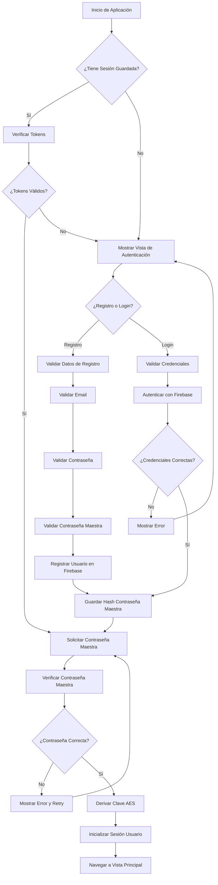
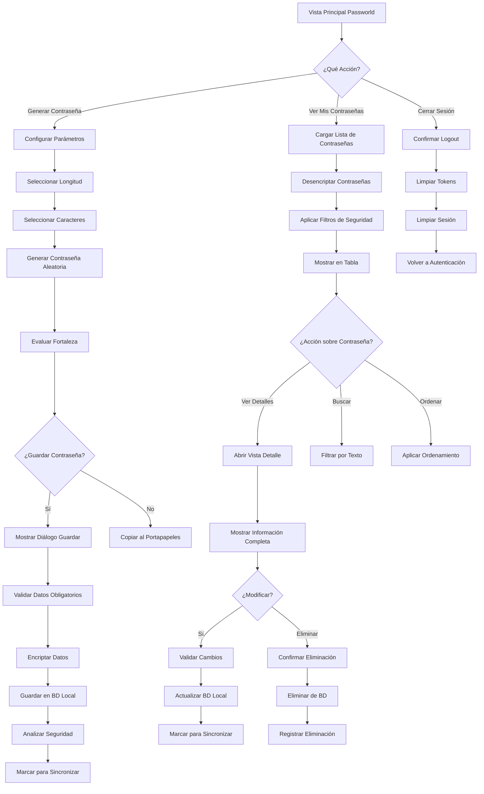
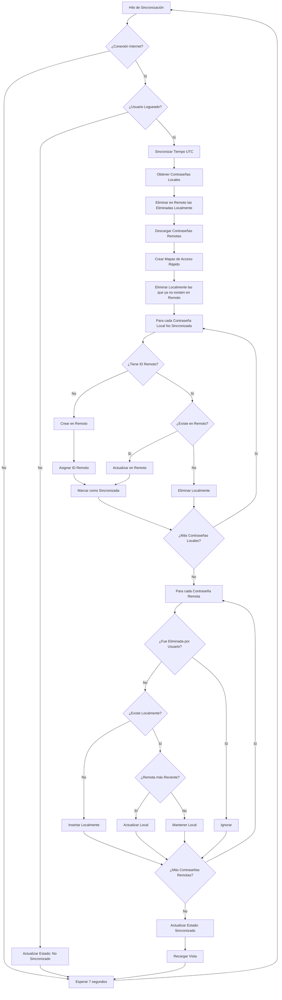
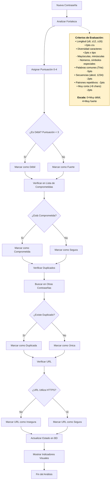
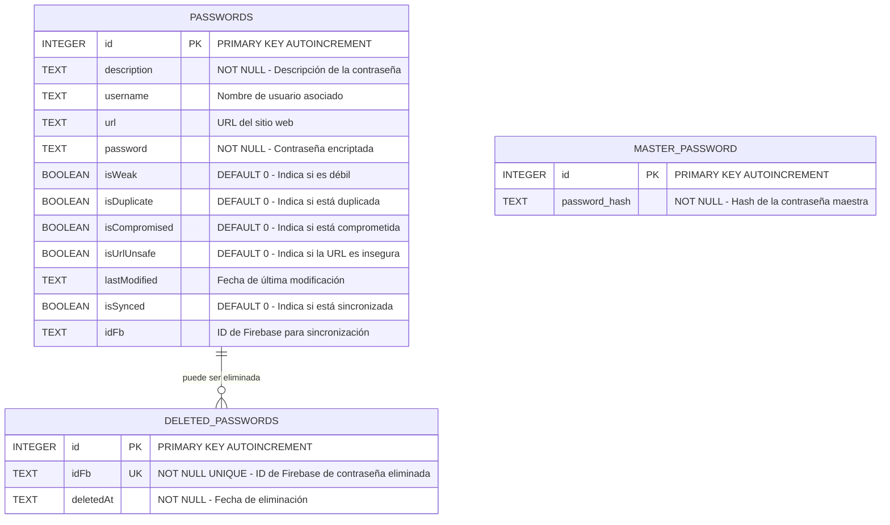
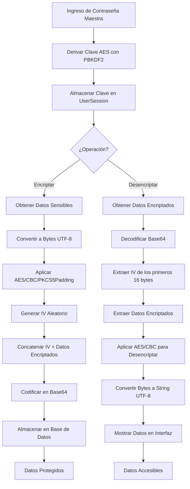
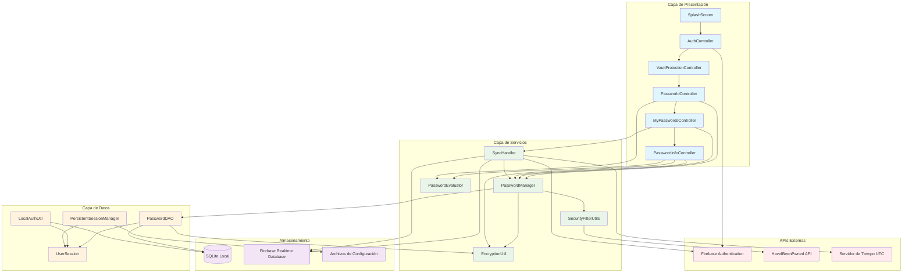
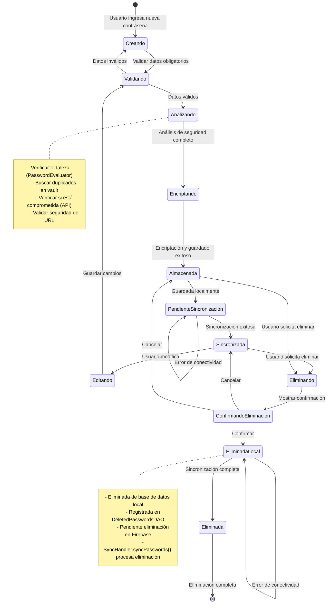

# Documentación Técnica - Passworld
## Diagramas de Flujo y Arquitectura del Sistema

Este documento contiene los diagramas técnicos más relevantes del proyecto Passworld, incluyendo diagramas de flujo de procesos, diagrama de clases y diagrama de base de datos.

---

## 1. Diagrama de Flujo - Proceso de Autenticación



---

## 2. Diagrama de Flujo - Gestión de Contraseñas



---

## 3. Diagrama de Flujo - Sincronización de Datos



---

## 4. Diagrama de Flujo - Evaluación de Seguridad de Contraseñas



---

## 5. Diagrama de Clases Completo del Sistema

```mermaid
classDiagram
    %% ================================
    %% PAQUETE: passworld (Principal)
    %% ================================
    class PassworldApplication {
        -HostServices hostServices
        +start(Stage primaryStage) void
        +main(String[] args) void
        +getHostServicesInstance() HostServices
    }
    
    class Main {
        +main(String[] args) void
    }
      %% ================================
    %% PAQUETE: passworld.controller
    %% ================================
    class AuthController {
        +initialize() void
        +showSignupSection() void
        +showLoginSection() void
        +handleSignup() void
        +handleLogin() void
        +showView() void
        -validateSignupFields() boolean
        -validateLoginFields() boolean
        -setupPasswordToggle() void
        -showErrorMessage(String) void
        -clearErrorMessages() void
    }
    
    class PassworldController {
        +initialize() void
        +generatePassword() void
        +savePassword() void
        +viewPasswords() void
        +handleLogout() void
        +showView() void
        -setupPasswordGeneration() void
        -updatePasswordLength() void
        -validateGenerationOptions() boolean
        -copyToClipboard(String) void
    }
    
    class MyPasswordsController {
        -List~PasswordDTO~ passwordList
        -List~PasswordDTO~ issuePasswordsList
        -List~PasswordDTO~ filteredPasswordsList
        +initialize() void
        +loadPasswords() void
        +showAllPasswords() void
        +showIssuePasswords() void
        +deletePassword(PasswordDTO) void
        +updatePassword(PasswordDTO, String, String, String, String) void
        +syncPasswordsPeriodically() void
        +refreshPasswords() void
        +showView() void
        -setupTable() void
        -setupPasswordEntry() void
        -setupInfoButton() void
        -filterPasswords() void
        -updateSyncStatus() void
    }
    
    class PasswordInfoController {
        -PasswordDTO password
        -MyPasswordsController parentController
        +initialize() void
        +setData(PasswordDTO, MyPasswordsController) void
        +showView(PasswordDTO, MyPasswordsController) void
        -savePassword() void
        -deletePassword() void
        -validateFields() void
        -checkPasswordIssues() void
        -setupPasswordToggle() void
        -setupSecurityWarnings() void
        -copyToClipboard(String) void
        -openUrl() void
    }
    
    class VaultProtectionController {
        -boolean passwordVerified
        +initialize() void
        +showView() void
        +showAndVerifyPassword() boolean
        -setupMasterPasswordField() void
        -setupPasswordToggle() void
        -verifyMasterPassword() void
        -isValidPassword(String) boolean
        -handleUnlock() void
    }
    
    class SplashScreenController {
        +initialize() void
        +showView() void
        -startProgressAnimation() void
        -initializeApplication() void
        -navigateToAuth() void
    }
    
    %% ================================
    %% PAQUETE: passworld.data
    %% ================================
    class PasswordDTO {
        -int id
        -String idFb
        -String description
        -String username
        -String url
        -String password
        -boolean isWeak
        -boolean isDuplicate
        -boolean isCompromised
        -boolean isUrlUnsafe
        -boolean isSynced
        -LocalDateTime lastModified
        +PasswordDTO()
        +PasswordDTO(String, String, String, String)
        +PasswordDTO(int, String, String, String, String, String)
        +getId() int
        +setId(int) void
        +getIdFb() String
        +setIdFb(String) void
        +getDescription() String
        +setDescription(String) void
        +getUsername() String
        +setUsername(String) void
        +getUrl() String
        +setUrl(String) void
        +getPassword() String
        +setPassword(String) void
        +isWeak() boolean
        +setWeak(boolean) void
        +isDuplicate() boolean
        +setDuplicate(boolean) void
        +isCompromised() boolean
        +setCompromised(boolean) void
        +isUrlUnsafe() boolean
        +setUrlUnsafe(boolean) void
        +isSynced() boolean
        +setSynced(boolean) void
        +getLastModified() LocalDateTime
        +setLastModified(LocalDateTime) void
        +hasSecurityIssues() boolean
        +toString() String
    }
    
    class PasswordDAO {
        -String DB_URL
        +createPassword(PasswordDTO) boolean
        +readAllPasswordsDecrypted() List~PasswordDTO~
        +readPasswordById(int) PasswordDTO
        +updatePassword(PasswordDTO) boolean
        +deletePassword(int) boolean
        +updatePasswordSecurity(PasswordDTO) void
        +existsByIdFb(String) boolean
        +updatePasswordSyncStatus(int, boolean) void
        +getUnsyncedPasswords() List~PasswordDTO~
        +deletePasswordByIdFb(String) boolean
        -encryptData(String) String
        -decryptData(String) String
        -mapResultSetToPasswordDTO(ResultSet) PasswordDTO
    }
    
    class DDL {
        +createDatabase() void
        +createPasswordsTable() void
        +createMasterPasswordTable() void
        +createDeletedPasswordsTable() void
        -executeUpdate(String) boolean
    }
    
    class LocalAuthUtil {
        +saveMasterPasswordHash(String) boolean
        +verifyMasterPassword(String) boolean
        +isMasterPasswordSet() boolean
        +deleteMasterPassword() boolean
        -hashPassword(String) String
        -verifyPassword(String, String) boolean
    }
    
    class DeletedPasswordsDAO {
        +addDeletedPassword(String) boolean
        +removeDeletedPassword(String) boolean
        +getAllDeletedPasswordIds() List~String~
        +isPasswordDeleted(String) boolean
        +clearDeletedPasswords() void
    }
    
    %% ================================
    %% PAQUETE: passworld.data.session
    %% ================================
    class UserSession {
        -String idToken
        -String refreshToken
        -String userId
        -String email
        -SecretKeySpec masterKey
        -UserSession instance
        +getInstance() UserSession
        +setIdToken(String) void
        +getIdToken() String
        +setRefreshToken(String) void
        +getRefreshToken() String
        +setUserId(String) void
        +getUserId() String
        +setEmail(String) void
        +getEmail() String
        +setMasterKey(SecretKeySpec) void
        +getMasterKey() SecretKeySpec
        +isLoggedIn() boolean
        +clearSession() void
    }
    
    class PersistentSessionManager {
        -String SESSION_FILE_PATH
        +saveSession(UserSession) void
        +loadSession() UserSession
        +deleteSession() void
        +hasValidSession() boolean
        -encryptSessionData(String) String
        -decryptSessionData(String) String
        -createSessionFile() void
    }
    
    %% ================================
    %% PAQUETE: passworld.data.sync
    %% ================================
    class SyncHandler {
        -PasswordsApiClient passwordsApiClient
        -UsersApiClient usersApiClient
        -PasswordManager passwordManager
        -DeletedPasswordsDAO deletedPasswordsDAO
        -boolean isSyncing
        -Timeline syncTimeline
        -Thread tokenRefreshThread
        +SyncHandler()
        +syncPasswords(List~PasswordDTO~) void
        +startPeriodicSync() void
        +stopPeriodicSync() void
        +hasInternetConnection() boolean
        +startTokenRefreshThread() void
        +stopTokenRefreshThread() void
        -syncDeletedPasswords() void
        -syncLocalToRemote(List~PasswordDTO~) void
        -syncRemoteToLocal(List~PasswordDTO~) void
        -shouldUpdateLocalPassword(PasswordDTO, PasswordDTO) boolean
        -getCurrentUTCTime() String
    }
    
    %% ================================
    %% PAQUETE: passworld.data.apiclients
    %% ================================
    class PasswordsApiClient {
        -String API_BASE_URL
        -OkHttpClient client
        -ObjectMapper objectMapper
        +createPassword(PasswordDTO) PasswordDTO
        +getPasswordsByUserId(String) List~PasswordDTO~
        +updatePassword(PasswordDTO) PasswordDTO
        +deletePassword(String) boolean
        +getServerTime() String
        -buildAuthenticatedRequest(String, String) Request.Builder
        -executeRequest(Request) Response
        -handleApiResponse(Response, Class) Object
    }
    
    class UsersApiClient {
        -String API_BASE_URL
        -OkHttpClient client
        -ObjectMapper objectMapper
        +refreshToken(String) Map~String,String~
        +getUserInfo(String) Map~String,Object~
        +validateToken(String) boolean
        -buildRequest(String, String) Request.Builder
        -executeRequest(Request) Response
        -parseJsonResponse(Response) Map~String,Object~
    }
    
    %% ================================
    %% PAQUETE: passworld.service
    %% ================================
    class PasswordManager {
        -PasswordDAO passwordDAO
        -SecurityFilterUtils securityFilterService
        +savePassword(PasswordDTO) boolean
        +updatePassword(PasswordDTO, String, String, String, String) boolean
        +deletePassword(int) boolean
        +getPasswordById(int) PasswordDTO
        +getAllPasswords() List~PasswordDTO~
        +getPasswordsWithIssues() List~PasswordDTO~
        +savePasswordFromRemote(PasswordDTO) void
        +updatePasswordByRemote(PasswordDTO) void
        +deletePasswordByRemoteId(String) void
        +getUnsyncedPasswords() List~PasswordDTO~
        -validatePasswordData(PasswordDTO) void
        -updateAllPasswordsSecurity() void
        -updatePasswordSecurity(PasswordDTO) void
    }
    
    %% ================================
    %% PAQUETE: passworld.utils
    %% ================================
    class EncryptionUtil {
        -String ALGORITHM
        -String TRANSFORMATION
        -String KEY_ALGORITHM
        -int KEY_LENGTH
        -int IV_LENGTH
        +deriveKeyFromPassword(String, byte[]) SecretKeySpec
        +generateSalt() byte[]
        +encrypt(String, SecretKeySpec) String
        +decrypt(String, SecretKeySpec) String
        -generateIV() byte[]
        -bytesToHex(byte[]) String
        -hexToBytes(String) byte[]
    }
    
    class SecurityFilterUtils {
        -Set~String~ uniquePasswords
        -Set~String~ commonPasswords
        -Set~String~ compromisedPasswords
        +SecurityFilterUtils()
        +analyzePasswordSecurity(PasswordDTO) void
        +hasPasswordSecurityIssues(PasswordDTO) boolean
        +addUniquePassword(String) void
        +removeUniquePassword(String) void
        +clearUniquePasswords() void
        +loadCommonPasswords() void
        -isPasswordWeak(String) boolean
        -isPasswordDuplicate(String) boolean
        -isPasswordCompromised(String) boolean
        -isUrlUnsafe(String) boolean
        -checkPasswordStrength(String) boolean
    }
      class PasswordEvaluator {
        -Set~String~ commonWords
        +calculateStrength(String) int
        +updatePasswordStrengthInfo(int, Label, ProgressBar) void
        +loadCommonWords() void
        +getStrengthText(int) String
        +getStrengthColor(int) String
        -hasUpperCase(String) boolean
        -hasLowerCase(String) boolean
        -hasDigits(String) boolean
        -hasSpecialChars(String) boolean
        -containsCommonWords(String) boolean
        -hasRepeatingPatterns(String) boolean
    }
    
    class PasswordGenerator {
        -String UPPERCASE
        -String LOWERCASE
        -String NUMBERS
        -String SPECIAL_CHARACTERS
        +generatePassword(boolean, boolean, boolean, int) String
    }
    
    class CompromisedPasswordChecker {
        -String API_URL
        +isCompromisedPassword(String) boolean
        -sha1(String) String
    }
    
    class UnsafeUrlChecker {
        -String API_URL
        -String API_KEY
        +isUnsafe(String) boolean
    }
    
    class TimeSyncManager {
        -Duration timeOffset
        -String NTP_SERVER
        -int NTP_PORT
        +syncTimeWithUtcServer() void
        +getCurrentUtcTime() String
        +adjustTimeByOffset(LocalDateTime) LocalDateTime
        -getNtpTime(String) long
    }
    
    class LogUtils {
        +Logger LOGGER
        -String logFilePath
        +initializeLogger() void
    }
    
    class Notifier {
        +showNotification(Window, String) void
    }
    
    class AnimationUtil {
        +shakeField(TextField) void
    }
    
    class Accessibility {
        +setSelectAllOnFocus(TextField) void
        +setShowLanguageListOnFocus(ComboBox) void
        +addCopyShortcut(TextField, Runnable) void
        +isMac() boolean
        +isWindows() boolean
    }
    
    class HeaderConfigurator {
        +configureHeader(ImageView, ImageView, Button, Button) void
        -configureLanguageMenu(ImageView) void
        -configureThemeButton(Button) void
        -configureHelpButton(Button) void
    }
    
    class Trie {
        -TrieNode root
        +Trie()
        +insert(String) void
        +search(String) boolean
        +containsSubstring(String) boolean
        -normalize(String) String
        -insert(TrieNode, String) void
        -commonPrefixLength(String, String) int
    }
    
    class ViewManager {
        -Stage primaryStage
        -Scene currentScene
        -ViewManager instance
        +getInstance() ViewManager
        +setPrimaryStage(Stage) void
        +getPrimaryStage() Stage
        +navigateToView(String) void
        +navigateToView(String, Object) void
        +showDialog(String, String, String) void
        +showConfirmationDialog(String, String) boolean
        -loadFXML(String) Parent
        -applyTheme(Scene) void
    }
    
    class ThemeManager {
        -String currentTheme
        -ThemeManager instance
        +getInstance() ThemeManager
        +getCurrentTheme() String
        +setTheme(String) void
        +isDarkMode() boolean
        +toggleTheme() void
        +applyTheme(Scene) void
        +getThemeStylesheet() String
        -saveThemePreference() void
        -loadThemePreference() void
    }
    
    class LanguageUtil {
        -ResourceBundle resourceBundle
        -Locale currentLocale
        -LanguageUtil instance
        +getInstance() LanguageUtil
        +setLocale(Locale) void
        +getCurrentLocale() Locale
        +getString(String) String
        +getString(String, Object...) String
        +getAvailableLocales() List~Locale~
        -loadResourceBundle() void
        -saveLocalePreference() void
        -loadLocalePreference() void
    }
    
    class DialogUtil {
        +showError(String, String) void
        +showWarning(String, String) void
        +showInfo(String, String) void
        +showConfirmation(String, String) boolean
        +showInputDialog(String, String) String
        +showPasswordDialog(String, String) String
        +showProgressDialog(String, Task) void
        -createAlert(Alert.AlertType, String, String) Alert
        -applyCurrentTheme(Alert) void
    }
      %% ================================
    %% RELACIONES ENTRE CLASES
    %% ================================
    
    %% Relaciones de la aplicación principal
    Main --> PassworldApplication : "inicia aplicación"
    PassworldApplication --> SplashScreenController : "muestra pantalla inicial"
    
    %% Relaciones de navegación entre controladores
    SplashScreenController --> AuthController : "navega hacia autenticación"
    AuthController --> VaultProtectionController : "navega tras login exitoso"
    VaultProtectionController --> PassworldController : "navega tras desbloqueo"
    PassworldController --> MyPasswordsController : "navega a vista contraseñas"
    MyPasswordsController --> PasswordInfoController : "navega a detalles"
    
    %% Relaciones de dependencia de servicios
    AuthController --> UserSession : "gestiona sesión usuario"
    AuthController --> LocalAuthUtil : "valida credenciales locales"
    AuthController --> ViewManager : "controla navegación"
    VaultProtectionController --> UserSession : "accede a sesión activa"
    VaultProtectionController --> LocalAuthUtil : "verifica contraseña maestra"
    PassworldController --> PasswordManager : "gestiona contraseñas"
    PassworldController --> PasswordEvaluator : "evalúa fortaleza"
    MyPasswordsController --> PasswordManager : "obtiene lista contraseñas"
    MyPasswordsController --> SyncHandler : "sincroniza datos"
    PasswordInfoController --> PasswordManager : "actualiza contraseñas"
    PasswordInfoController --> PasswordEvaluator : "analiza seguridad"
    
    %% Relaciones del servicio principal
    PasswordManager --> PasswordDAO : "persiste datos"
    PasswordManager --> SecurityFilterUtils : "analiza seguridad"
    PasswordManager --> PasswordDTO : "manipula entidades"
    
    %% Relaciones de acceso a datos
    PasswordDAO --> UserSession : "obtiene clave encriptación"
    PasswordDAO --> EncryptionUtil : "encripta/desencripta datos"
    PasswordDAO --> PasswordDTO : "mapea entidades"
    DDL --> PasswordDAO : "crea estructura BD"
    LocalAuthUtil --> EncryptionUtil : "encripta hash contraseña"
    
    %% Relaciones de sincronización
    SyncHandler --> PasswordsApiClient : "sincroniza contraseñas"
    SyncHandler --> UsersApiClient : "gestiona tokens usuario"
    SyncHandler --> PasswordManager : "coordina datos locales"
    SyncHandler --> DeletedPasswordsDAO : "rastrea eliminaciones"
    SyncHandler --> UserSession : "obtiene tokens autenticación"
    
    %% Relaciones de sesión
    UserSession --> PersistentSessionManager : "persiste sesión"
    PersistentSessionManager --> EncryptionUtil : "encripta datos sesión"
    
    %% Relaciones de utilidades de seguridad
    SecurityFilterUtils --> PasswordEvaluator : "evalúa fortaleza"
    SecurityFilterUtils --> CompromisedPasswordChecker : "verifica brechas seguridad"
    SecurityFilterUtils --> UnsafeUrlChecker : "valida URLs seguras"
    SecurityFilterUtils --> Trie : "busca palabras comunes"
    PassworldController --> PasswordGenerator : "genera contraseñas aleatorias"
    PasswordEvaluator --> Trie : "busca patrones comunes"
    
    %% Relaciones de gestión UI
    ViewManager --> ThemeManager : "aplica temas visuales"
    ViewManager --> LanguageUtil : "aplica idiomas"
    ThemeManager --> ViewManager : "notifica cambios tema"
    SyncHandler --> TimeSyncManager : "sincroniza tiempo UTC"
    
    %% Relaciones de interfaz y experiencia usuario
    AuthController --> ThemeManager : "aplica tema actual"
    AuthController --> LanguageUtil : "obtiene textos localizados"
    AuthController --> DialogUtil : "muestra mensajes usuario"
    AuthController --> HeaderConfigurator : "configura cabecera vista"
    AuthController --> Accessibility : "mejora accesibilidad"
    AuthController --> AnimationUtil : "aplica animaciones feedback"
    PassworldController --> DialogUtil : "muestra confirmaciones"
    PassworldController --> Notifier : "notifica acciones realizadas"
    PassworldController --> Accessibility : "habilita atajos teclado"
    MyPasswordsController --> DialogUtil : "confirma eliminaciones"
    MyPasswordsController --> Notifier : "notifica sincronización"
    PasswordInfoController --> DialogUtil : "valida datos entrada"
    PasswordInfoController --> Notifier : "confirma guardado exitoso"
    PasswordInfoController --> Accessibility : "facilita navegación"
    
    %% Relaciones de logging y monitoreo
    CompromisedPasswordChecker --> LogUtils : "registra verificaciones API"
    UnsafeUrlChecker --> LogUtils : "registra consultas seguridad"
    TimeSyncManager --> LogUtils : "registra sincronización tiempo"
    HeaderConfigurator --> LogUtils : "registra errores configuración"
```

---

## 6. Diagrama de Base de Datos



---

## 7. Diagrama de Flujo - Proceso de Encriptación/Desencriptación



---

## 8. Diagrama de Arquitectura del Sistema



---

## 9. Diagrama de Estados - Ciclo de Vida de una Contraseña



---

## 10. Resumen de Componentes Principales

### Controladores de Vista
- **AuthController**: Maneja registro y autenticación de usuarios
- **VaultProtectionController**: Gestiona el desbloqueo con contraseña maestra
- **PassworldController**: Vista principal para generar contraseñas
- **MyPasswordsController**: Lista y gestión de contraseñas guardadas
- **PasswordInfoController**: Detalles y edición de contraseñas individuales

### Servicios de Negocio
- **PasswordManager**: Lógica principal de gestión de contraseñas
- **SyncHandler**: Sincronización con Firebase
- **SecurityFilterUtils**: Análisis de seguridad de contraseñas
- **PasswordEvaluator**: Evaluación de fortaleza de contraseñas

### Acceso a Datos
- **PasswordDAO**: Operaciones CRUD en base de datos local
- **UserSession**: Gestión de sesión y claves de encriptación
- **PersistentSessionManager**: Persistencia de tokens de autenticación

### Utilidades
- **EncryptionUtil**: Funciones de encriptación/desencriptación
- **ViewManager**: Gestión de navegación entre vistas
- **ThemeManager**: Gestión de temas claro/oscuro
- **LanguageUtil**: Soporte de internacionalización

Esta documentación proporciona una visión completa de la arquitectura y flujos principales del sistema Passworld, facilitando el entendimiento y mantenimiento del código.
