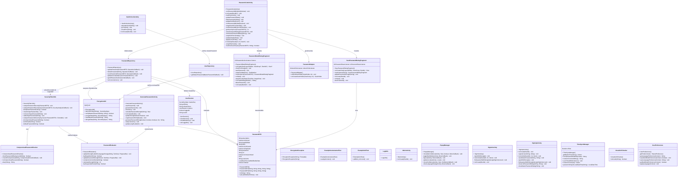

```mermaid
classDiagram
direction BT

CompromisedPasswordChecker <-- SecurityFilterUtils : usa
    EncryptionUtil <-- PasswordRepository : usa para cifrar/descifrar
    PasswordDTO <-- PasswordRepository : manipula
    PasswordDTO <-- SecurityFilterUtils : analiza
    PasswordDTO <-- PasswordDetailDialogFragment : muestra/edita
    PasswordDTO <-- SavePasswordDialogFragment : crea
    PasswordEvaluator <-- SecurityFilterUtils : evalúa fortaleza
    PasswordEvaluator <-- GeneratePasswordActivity : calcula fuerza
    
    UserSession <-- PasswordRepository : obtiene masterKey
    SecurityFilterUtils <-- PasswordRepository : actualiza estado de seguridad
    
    PasswordAdapter <-- PasswordListActivity : gestiona lista
    PasswordRepository <-- PasswordListActivity : obtiene datos
    
    PasswordDetailDialogFragment <-- PasswordListActivity : muestra
    SavePasswordDialogFragment <-- PasswordListActivity : muestra
    
    UserRepository <-- VaultUnlockActivity : verifica masterPassword
    EncryptionUtil <-- UserRepository : verifica contraseñas

class CompromisedPasswordChecker {
  + CompromisedPasswordChecker() 
  - checkPasswordInBackground(String) boolean
  + checkIfCompromised(String, CompromisedCheckCallback) void
  + isCompromisedPassword(String) boolean
  - sha1(String) String
}
class EncryptionException {
  + EncryptionException(String, Throwable) 
  + EncryptionException(String) 
}
class EncryptionUtil {
  + EncryptionUtil() 
  + deriveAESKey(String) SecretKeySpec
  + verifyMasterPassword(String, String) boolean
  + encryptData(String, SecretKeySpec) String
  + hashMasterPassword(String) String
  + decryptData(String, SecretKeySpec) String
   byte[] salt
}
class ExampleInstrumentedTest {
  + ExampleInstrumentedTest() 
  + useAppContext() void
}
class ExampleUnitTest {
  + ExampleUnitTest() 
  + addition_isCorrect() void
}
class GeneratePasswordActivity {
  + GeneratePasswordActivity() 
  - savePassword() void
  - generatePassword() void
  - initViews() void
  - calculatePasswordStrength(String) float
  # onCreate(Bundle) void
  - updateStrengthIndicatorText(int) void
  - copyPasswordToClipboard() void
  - generatePasswordString(boolean, boolean, boolean, int) String
  - setupListeners() void
  - updateLengthLabel(int) void
}
class LogUtils {
  + LogUtils() 
}
class MainActivity {
  + MainActivity() 
  # onCreate(Bundle) void
}
class PasswordAdapter {
  + PasswordAdapter() 
  + onBindViewHolder(ViewHolder, int) void
  + onCreateViewHolder(ViewGroup, int) ViewHolder
   OnItemClickListener onItemClickListener
}
class PasswordDTO {
  + PasswordDTO() 
  + PasswordDTO(String, String, String, String, String) 
  + PasswordDTO(String, String, String, String) 
  + toString() String
  + setLastModifiedToNow() void
   String description
   boolean isSynced
   String lastModified
   String idFb
   boolean isUrlUnsafe
   boolean isDuplicate
   String password
   String url
   boolean isCompromised
   int id
   String username
   LocalDateTime lastModifiedAsDate
   boolean isWeak
}
class PasswordDetailDialogFragment {
  + PasswordDetailDialogFragment() 
  + onCreateView(LayoutInflater, ViewGroup?, Bundle?) View?
  - checkForChanges() void
  - savePassword() void
  - createTextWatcher() TextWatcher
  + newInstance(PasswordDTO) PasswordDetailDialogFragment
  + onStart() void
  - setupSecurityStatus(TextView, ImageView) void
  + onCreateDialog(Bundle?) Dialog
  - deletePassword() void
  + onCreate(Bundle?) void
   OnPasswordActionListener listener
}
class PasswordEvaluator {
  + PasswordEvaluator() 
  + updateStrengthLabelOnLanguageChange(String, TextView, ProgressBar) void
  - hasRepetition(String) boolean
  + updatePasswordStrengthInfo(int, TextView, ProgressBar) void
  + containsCommonWords(String) boolean
  + calculateStrength(String) int
  - hasSequentialChars(String) boolean
}
class PasswordListActivity {
  + PasswordListActivity() 
  - sortPasswordsByName(boolean) void
  # onCreate(Bundle?) void
  - loadPasswords() void
  - updatePasswordStats() void
  - filterPasswords(String) void
  - updateCardSelection() void
  - sortPasswordsByDate(boolean) void
  - setupSearchFunctionality() void
  - sortPasswordsBySecurity(boolean) void
  - getSecurityScore(PasswordDTO) int
  - showPasswordDialog(PasswordDTO) void
  - showSavePasswordDialog(String) void
  - setupSortFunctionality() void
  - updateAdapterData() void
  - applyCurrentFilter() void
  # onActivityResult(int, int, Intent?) void
  - setupFilterCards() void
  - matchesSearchQuery(PasswordDTO, String) boolean
}
class PasswordRepository {
  + PasswordRepository() 
  + updatePassword(PasswordDTO, OperationCallback) void
  + deletePassword(String, OperationCallback) void
  + savePassword(PasswordDTO, OperationCallback) void
  - updateSecurityStatus(List~PasswordDTO~) void
  + getAllPasswords(PasswordsCallback) void
  + removeListeners() void
}
class PopupManager {
  + PopupManager() 
  + showOptionsMenu(Activity, View, boolean, MenuCallback) void
  - toggleDarkMode(Activity, MenuCallback) void
  - logout(Activity, MenuCallback) void
  - updateLocale(Activity, Locale) void
  + showSortMenu(Activity, View, SortMenuCallback) void
  - showLanguageDialog(Activity, MenuCallback) void
}
class SavePasswordDialogFragment {
  + SavePasswordDialogFragment() 
  + onCreateView(LayoutInflater, ViewGroup, Bundle) View
  + newInstance(String) SavePasswordDialogFragment
  - updatePasswordStrength(String) void
  + onCreate(Bundle) void
  + onStart() void
  - savePassword() void
   OnPasswordSaveListener onPasswordSaveListener
}
class SecurityFilterUtils {
  + SecurityFilterUtils() 
  + analyzePasswordSecurity(PasswordDTO) void
  + analyzePasswordSecurityAsync(PasswordDTO, SecurityAnalysisCallback) void
  - isDuplicatePassword(String) boolean
  + clearUniquePasswords() void
  + removeUniquePassword(String) void
  + addUniquePassword(String) void
  + analyzePasswordsSecurityAsync(List~PasswordDTO~, Runnable) void
  - isCompromisedPassword(String) boolean
  - isUrlUnsafe(String) boolean
  - isWeakPassword(String) boolean
}
class SignInActivity {
  + SignInActivity() 
  - signInWithGoogle() void
  # onActivityResult(int, int, Intent) void
  - firebaseAuthWithGoogle(GoogleSignInAccount) void
  # onCreate(Bundle) void
}
class SignUpActivity {
  + SignUpActivity() 
  # onCreate(Bundle) void
  - registerUser(String, String) void
  # onActivityResult(int, int, Intent) void
  - saveMasterPassword(String, String) void
  - signInWithGoogle() void
  - firebaseAuthWithGoogle(GoogleSignInAccount) void
  - showLinkPasswordDialog(String, String) void
  - showMasterPasswordDialog(String) void
}
class TimeSyncManager {
  + TimeSyncManager() 
  - getNtpUtcTime(String) Instant
  + formatInstantUtcWithZ(Instant) String
  + nowUtcCorrectedString() String
  + syncTimeWithUtcServer() void
  + nowUtcCorrected() Instant
  + parseUtcStringToLocalDateTime(String) LocalDateTime
   Duration offset
}
class UnsafeUrlChecker {
  + UnsafeUrlChecker() 
  + isUnsafe(String) boolean
}
class UserPreferences {
  + UserPreferences() 
  - getPrefs(Context) SharedPreferences
  + getLanguagePreference(Context) String
  + saveDarkModePreference(Context, boolean) void
  + saveLanguagePreference(Context, String) void
  + getDarkModePreference(Context) boolean
  + applyLanguage(Context) void
}
class UserRepository {
  + UserRepository() 
  + getMasterPassword(MasterPasswordCallback) void
}
class UserSession {
  - UserSession() 
  + clearSession() void
  + clearMasterKey() void
  + setLoggedIn() void
   SecretKeySpec masterKey
   String idToken
   String refreshToken
   UserSession instance
   boolean loggedIn
   String userId
}
class VaultUnlockActivity {
  + VaultUnlockActivity() 
  - attemptUnlock(String) void
  - goToVault() void
  - showError(String) void
  # onCreate(Bundle) void
}


```
