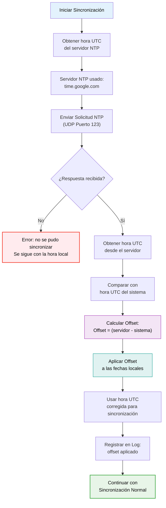

# Aplicación Escritorio - Sincronización Horaria NTP

## Descripción
Este diagrama muestra el proceso de sincronización horaria mediante protocolo NTP (Network Time Protocol) en la aplicación de escritorio PassWorld. La sincronización temporal es crucial para mantener la coherencia en las operaciones de sincronización de contraseñas entre dispositivos.

## Propósito
- **Coherencia temporal**: Asegurar que todas las operaciones tengan timestamps precisos  
- **Resolución de conflictos**: Determinar qué versión de datos es más reciente  
- **Integridad de sincronización**: Evitar inconsistencias por diferencias horarias

# Detalles Técnicos

## Servidor NTP Utilizado  
- `time.google.com` – Servidor principal (único usado actualmente)

## Algoritmo de Sincronización  
- **Protocolo:** NTP v4  
- **Puerto:** UDP 123  
- **Timeout:** 3 segundos por solicitud  
- **Offset:** Diferencia entre hora del sistema y hora UTC del servidor

## Qué hace el sistema  
- Usa Apache Commons Net (`NTPUDPClient`) para obtener la hora UTC desde un servidor NTP.  
- Calcula el offset entre la hora del sistema y la del servidor.  
- Aplica el offset para ajustar cualquier marca temporal antes de sincronizar.  
- En caso de error, se registra un warning y se sigue usando la hora local.

## Beneficios  
- ✅ Timestamps corregidos con hora UTC real  
- ✅ Resolución de conflictos más precisa  
- ✅ Registro en logs del offset aplicado  
- ✅ Tolerancia a fallos (sigue funcionando sin NTP)

