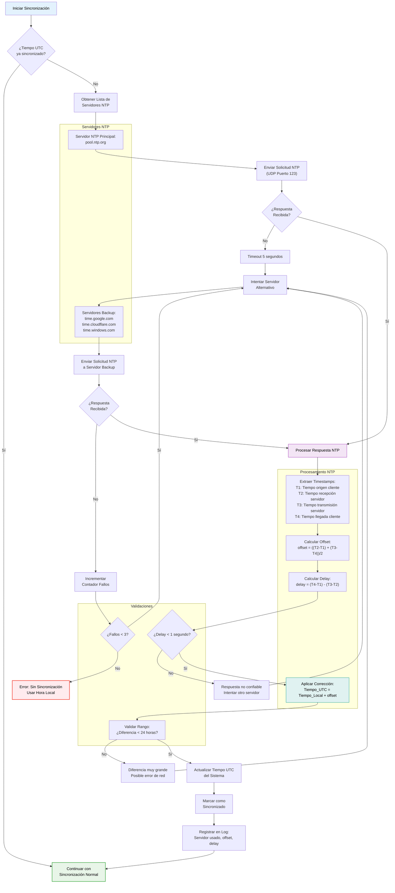

# Aplicación Escritorio - Sincronización Horaria NTP

## Descripción
Este diagrama muestra el proceso de sincronización horaria mediante protocolo NTP (Network Time Protocol) en la aplicación de escritorio PassWorld. La sincronización temporal es crucial para mantener la coherencia en las operaciones de sincronización de contraseñas entre dispositivos.

## Propósito
- **Coherencia temporal**: Asegurar que todas las operaciones tengan timestamps precisos
- **Resolución de conflictos**: Determinar qué versión de datos es más reciente
- **Integridad de sincronización**: Evitar inconsistencias por diferencias horarias

## Detalles Técnicos

### Servidores NTP Utilizados
1. **Principal**: `pool.ntp.org` - Pool global de servidores NTP
2. **Backup**:
   - `time.google.com` - Servidores de Google
   - `time.cloudflare.com` - Servidores de Cloudflare  
   - `time.windows.com` - Servidores de Microsoft

### Algoritmo de Sincronización
- **Protocolo**: NTP versión 4 (RFC 5905)
- **Puerto**: UDP 123
- **Timeout**: 5 segundos por solicitud
- **Reintentos**: Máximo 3 fallos antes de usar hora local

### Cálculos NTP
- **Offset**: `((T2-T1) + (T3-T4))/2` - Diferencia horaria con el servidor
- **Delay**: `(T4-T1) - (T3-T2)` - Tiempo de red ida y vuelta
- **Precisión**: Milisegundos

### Validaciones de Seguridad
- **Delay máximo**: 1 segundo (evita respuestas de red lenta)
- **Diferencia máxima**: 24 horas (detecta errores graves)
- **Múltiples fuentes**: Fallback a servidores alternativos

## Beneficios
- ✅ **Timestamps precisos** para operaciones de sincronización
- ✅ **Resolución de conflictos** basada en tiempo real
- ✅ **Redundancia** con múltiples servidores NTP
- ✅ **Tolerancia a fallos** con fallback a hora local
- ✅ **Validación robusta** contra ataques de red
