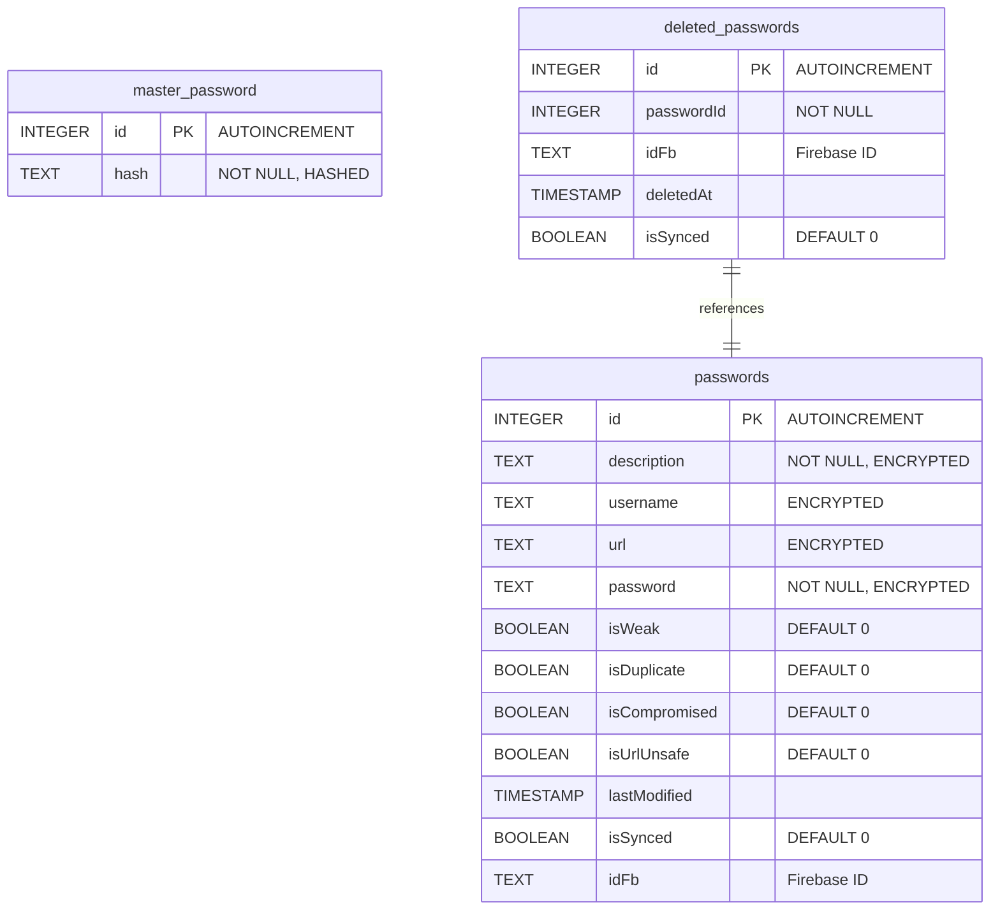

```mermaid
erDiagram
    passwords {
        INTEGER id PK "AUTOINCREMENT"
        TEXT description "NOT NULL, ENCRYPTED"
        TEXT username "ENCRYPTED"
        TEXT url "ENCRYPTED"
        TEXT password "NOT NULL, ENCRYPTED"
        BOOLEAN isWeak "DEFAULT 0"
        BOOLEAN isDuplicate "DEFAULT 0"
        BOOLEAN isCompromised "DEFAULT 0"
        BOOLEAN isUrlUnsafe "DEFAULT 0"
        TIMESTAMP lastModified
        BOOLEAN isSynced "DEFAULT 0"
        TEXT idFb "Firebase ID"
    }
    
    master_password {
        INTEGER id PK "AUTOINCREMENT"
        TEXT hash "NOT NULL, HASHED"
    }
    
    deleted_passwords {
        INTEGER id PK "AUTOINCREMENT"
        INTEGER passwordId "NOT NULL"
        TEXT idFb "Firebase ID"
        TIMESTAMP deletedAt
        BOOLEAN isSynced "DEFAULT 0"
    }
    
    deleted_passwords ||--|| passwords : "references"
```