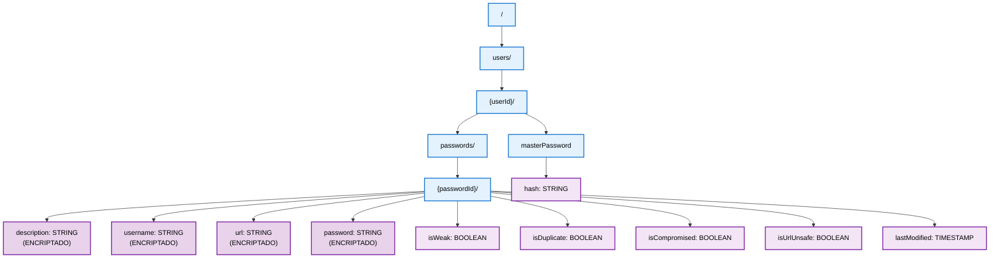

```mermaid
flowchart TD
    Root["/"] --> Users["users/"]
    Users --> UserID["{userId}/"]
    UserID --> Passwords["passwords/"] & MasterPassword["masterPassword"]
    Passwords --> PasswordID["{passwordId}/"]
    PasswordID --> Description["description: STRING<br>(ENCRIPTADO)"] & Username["username: STRING<br>(ENCRIPTADO)"] & URL["url: STRING <br>(ENCRIPTADO)"] & Password["password: STRING<br>(ENCRIPTADO)"] & IsWeak["isWeak: BOOLEAN"] & IsDuplicate["isDuplicate: BOOLEAN"] & IsCompromised["isCompromised: BOOLEAN"] & IsUrlUnsafe["isUrlUnsafe: BOOLEAN"] & LastModified["lastModified: TIMESTAMP"]
    MasterPassword --> Hash["hash: STRING"]

     Root:::structure
     Users:::structure
     UserID:::structure
     Passwords:::structure
     MasterPassword:::structure
     PasswordID:::structure
     Description:::encrypted
     Username:::encrypted
     URL:::encrypted
     Password:::encrypted
     IsWeak:::data
     IsDuplicate:::data
     IsCompromised:::data
     IsUrlUnsafe:::data
     LastModified:::data
     Hash:::data
    classDef encrypted fill:#e8d3eb,stroke:#7b1fa2,stroke-width:2px,color:#000000
    classDef structure fill:#e3f2fd,stroke:#1976d2,stroke-width:2px,color:#000000
    classDef data fill:#f3e5f5,stroke:#7b1fa2,stroke-width:2px,color:#000000
```
