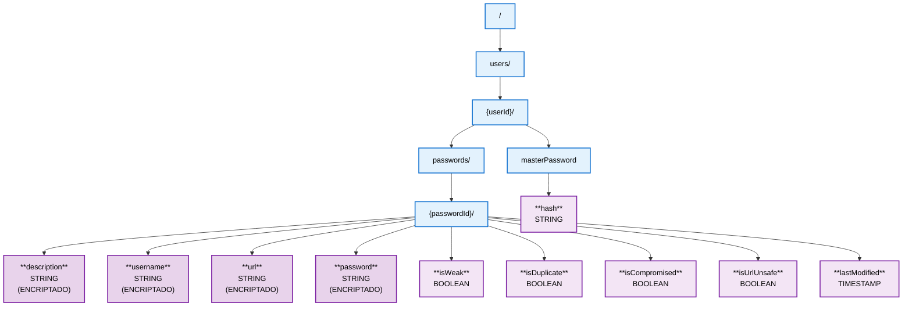

```mermaid
flowchart TD
    Root["/"] --> Users["users/"]
    Users --> UserID["{userId}/"]
    UserID --> Passwords["passwords/"] & MasterPassword["masterPassword"]
    Passwords --> PasswordID["{passwordId}/"]
    PasswordID --> Description["**description**<br>STRING<br>(ENCRIPTADO)"] & Username["**username**<br>STRING<br>(ENCRIPTADO)"] & URL["**url**<br>STRING <br>(ENCRIPTADO)"] & Password["**password**<br>STRING<br>(ENCRIPTADO)"] & IsWeak["**isWeak**<br>BOOLEAN"] & IsDuplicate["**isDuplicate**<br>BOOLEAN"] & IsCompromised["**isCompromised**<br>BOOLEAN"] & IsUrlUnsafe["**isUrlUnsafe**<br>BOOLEAN"] & LastModified["**lastModified**<br>TIMESTAMP"]
    MasterPassword --> Hash["**hash**<br>STRING"]
     Root:::structure
     Users:::structure
     UserID:::structure
     Passwords:::structure
     MasterPassword:::structure
     PasswordID:::structure
     Description:::encrypted
     Username:::encrypted
     URL:::encrypted
     Password:::encrypted
     IsWeak:::data
     IsDuplicate:::data
     IsCompromised:::data
     IsUrlUnsafe:::data
     LastModified:::data
     Hash:::data
    classDef encrypted fill:#e8d3eb,stroke:#7b1fa2,stroke-width:2px,color:#000000
    classDef structure fill:#e3f2fd,stroke:#1976d2,stroke-width:2px,color:#000000
    classDef data fill:#f3e5f5,stroke:#7b1fa2,stroke-width:2px,color:#000000
```
