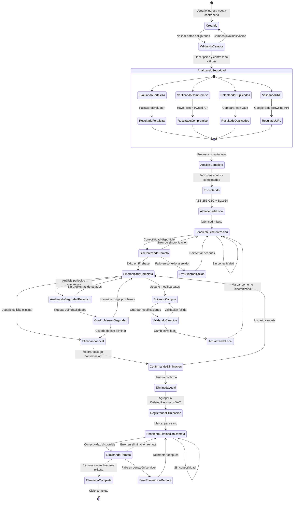

# Diagrama de Estados - Ciclo de Vida de una Contraseña en PASSWORLD

## Descripción General
Este diagrama muestra todos los estados posibles que puede tener una contraseña durante su ciclo de vida completo en el sistema PASSWORLD, desde su creación hasta su eliminación definitiva, incluyendo procesos de validación, encriptación, sincronización y análisis de seguridad.

## Diagrama de Estados

## Estados Detallados

### **Estados de Creación**
- **Creando**: Usuario está ingresando datos de nueva contraseña
- **ValidandoCampos**: Verificación de campos obligatorios (descripción, contraseña)
- **AnalizandoSeguridad**: Análisis simultáneo de múltiples aspectos de seguridad
- **Encriptando**: Aplicación de AES-256-CBC con IV aleatorio

### **Estados de Almacenamiento**
- **AlmacenadaLocal**: Contraseña guardada en SQLite local, encriptada
- **PendienteSincronizacion**: Esperando sincronización con Firebase (`isSynced = false`)
- **SincronizandoRemoto**: Proceso activo de subida a Firebase
- **SincronizadaCompleta**: Datos consistentes en local y remoto (`isSynced = true`)

### **Estados de Seguridad**
- **AnalizandoSeguridad**: Análisis inicial durante la creación (fortaleza, compromiso, duplicados, URL)
- **AnalizandoSeguridadPeriodico**: Análisis automático periódico de vulnerabilidades (mismo proceso que inicial)
- **ConProblemasSeguridad**: Problemas detectados (débil, duplicada, comprometida, URL insegura)

### **Estados de Modificación**
- **EditandoCampos**: Usuario modificando datos existentes
- **ValidandoCambios**: Verificación de modificaciones
- **ActualizandoLocal**: Aplicando cambios a base de datos local

### **Estados de Eliminación**
- **EliminandoLocal**: Proceso de eliminación iniciado
- **ConfirmandoEliminacion**: Diálogo de confirmación mostrado
- **EliminadaLocal**: Eliminada de SQLite local
- **RegistrandoEliminacion**: Registro en `deleted_passwords` tabla
- **PendienteEliminacionRemota**: Esperando eliminación en Firebase
- **EliminandoRemoto**: Eliminando de Firebase
- **EliminadaCompleta**: Eliminación total completada

### **Estados de Error**
- **ErrorSincronizacion**: Fallos temporales en sincronización
- **ErrorEliminacionRemota**: Fallos temporales en eliminación remota

## Procesos Técnicos Involucrados

### **Análisis de Seguridad**
- **Evaluación de Fortaleza**: `PasswordEvaluator.calculateStrength()`
- **Verificación de Compromiso**: Have I Been Pwned API con k-anonymity
- **Detección de Duplicados**: Comparación con vault local
- **Validación de URL**: Google Safe Browsing API

### **Encriptación**
- **Algoritmo**: AES-256-CBC-PKCS5Padding
- **Vector de Inicialización**: 16 bytes aleatorios por operación
- **Clave**: Derivada de contraseña maestra con PBKDF2-SHA256
- **Codificación**: Base64 para almacenamiento

### **Sincronización**
- **Hilo Dedicado**: `SyncHandler.syncPasswords()` ejecuta cada 7 segundos
- **Manejo de Conflictos**: Timestamps para determinar versión más reciente
- **Recuperación**: Reintentos automáticos en caso de fallos de conectividad

### **Tracking de Eliminaciones**
- **Tabla `deleted_passwords`**: Registro de IDs Firebase eliminados
- **Prevención de Re-sincronización**: Evita que contraseñas eliminadas vuelvan a aparecer
- **Limpieza**: Eliminación de registros de tracking tras sincronización exitosa

## Notas Importantes

1. **Persistencia de Estados**: Los estados de sincronización persisten entre sesiones
2. **Análisis Automático**: Los problemas de seguridad se detectan automáticamente en segundo plano. El sistema ejecuta análisis de seguridad automáticamente en múltiples momentos:
- ***Durante la creación*** (estado `AnalizandoSeguridad`): Evaluación inicial obligatoria
- ***Periódicamente*** (estado `AnalizandoSeguridadPeriodico`): Cada 7 segundos en escritorio, cada 10 segundos en extensión web
- ***Durante modificaciones***: Re-análisis automático al actualizar contraseñas
- ***Post-eliminación***: Análisis de contraseñas restantes tras eliminar una
3. **Tolerancia a Fallos**: El sistema maneja desconexiones y errores temporales
4. **Integridad Referencial**: Los registros de eliminación mantienen la consistencia entre local y remoto
5. **Seguridad First**: Todos los datos sensibles están encriptados en reposo y en tránsito
