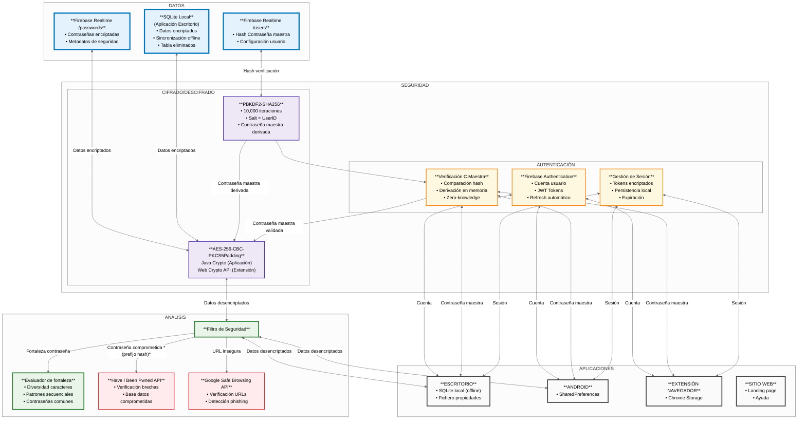

```mermaid
---
config:
  theme: neutral
---
graph TB
    subgraph DATOS["DATOS"]
        direction LR
        FIREBASE_PASSWORDS["**Firebase Realtime /passwords**<br/>• Contraseñas encriptadas<br/>• Metadatos de seguridad"]
        FIREBASE_USERS["**Firebase Realtime /users**<br/>• Hash Contraseña maestra<br/>• Configuración usuario"]
        SQLITE_LOCAL["**SQLite Local**<br/>(Aplicación Escritorio)<br/>• Datos encriptados<br/>• Sincronización offline<br/>• Tabla eliminados"]
    end

    subgraph SEGURIDAD["SEGURIDAD"]
        direction TB
        
        %% Subcapa de Autenticación (nivel superior en seguridad)
        subgraph AUTH_LAYER["AUTENTICACIÓN"]
            direction LR
            FIREBASE_AUTH["**Firebase Authentication**<br/>• Cuenta usuario<br/>• JWT Tokens<br/>• Refresh automático"]
            SESSION_MGMT["**Gestión de Sesión**<br/>• Tokens encriptados<br/>• Persistencia local<br/>• Expiración"]
            MASTER_VERIFY["**Verificación C.Maestra**<br/>• Comparación hash<br/>• Derivación en memoria<br/>• Zero-knowledge"]
        end
        
        %% Subcapa de Cifrado (nivel inferior en seguridad)
        subgraph CRYPTO_LAYER["CIFRADO/DESCIFRADO"]
            direction LR
            AES["**AES-256-CBC-PKCS5Padding**<br/>Java Crypto (Aplicación)<br/>Web Crypto API (Extensión)"]
            PBKDF2_ALGO["**PBKDF2-SHA256**<br/>• 10,000 iteraciones<br/>• Salt = UserID<br/>• Contraseña maestra derivada"]
        end
    end

    subgraph ANALISIS["ANÁLISIS"]
        direction LR
        SECURITY_FILTER["**Filtro de Seguridad**"]
        EVALUATOR["**Evaluador de fortaleza**<br/>• Diversidad caracteres<br/>• Patrones secuenciales<br/>• Contraseñas comunes"]
        HIBP_API["**Have I Been Pwned API**<br/>• Verificación brechas<br/>• Base datos comprometidas"]
        GOOGLE_SAFE["**Google Safe Browsing API**<br/>• Verificación URLs<br/>• Detección phishing"]
    end

    subgraph APPS["APLICACIONES"]
        direction LR
        DESKTOP["**ESCRITORIO**<br/>• SQLite local (offline)<br/>• Fichero propiedades"]
        ANDROID["**ANDROID**<br/>• SharedPreferences"]
        WEBEXT["**EXTENSIÓN NAVEGADOR**<br/>• Chrome Storage"]
        WEBSITE["**SITIO WEB**<br/>• Landing page<br/>• Ayuda"]
    end
    
    FIREBASE_PASSWORDS <-->|"Datos encriptados"| AES
    FIREBASE_USERS <-->|"Hash verificación"| PBKDF2_ALGO
    SQLITE_LOCAL <-->|"Datos encriptados"| AES
    
    AES <-->|"Datos desencriptados"| SECURITY_FILTER
    
    SECURITY_FILTER -->|"Fortaleza contraseña"| EVALUATOR
    SECURITY_FILTER -->|"Contraseña comprometida *(prefijo hash)*"| HIBP_API
    SECURITY_FILTER -->|"URL insegura"| GOOGLE_SAFE
    
    SECURITY_FILTER <-->|"Datos desencriptados"| DESKTOP
    SECURITY_FILTER <-->|"Datos desencriptados"| ANDROID
    
    PBKDF2_ALGO -->|"Contraseña maestra derivada"| AES
    PBKDF2_ALGO --> MASTER_VERIFY
    
    MASTER_VERIFY -->|"Contraseña maestra validada"| AES
    
    FIREBASE_AUTH <-->|"Cuenta"| DESKTOP
    FIREBASE_AUTH <-->|"Cuenta"| ANDROID
    FIREBASE_AUTH <-->|"Cuenta"| WEBEXT
    MASTER_VERIFY <-->|"Contraseña maestra"| DESKTOP
    MASTER_VERIFY <-->|"Contraseña maestra"| ANDROID
    MASTER_VERIFY <-->|"Contraseña maestra"| WEBEXT
    SESSION_MGMT <-->|"Sesión"| DESKTOP
    SESSION_MGMT <-->|"Sesión"| ANDROID
    SESSION_MGMT <-->|"Sesión"| WEBEXT

    %% === ESTILOS POR CAPA ===
    classDef dataStyle fill:#e3f2fd,stroke:#0277bd,stroke-width:4px
    classDef securityStyle fill:#f3e5f5,stroke:#7b1fa2,stroke-width:3px
    classDef authStyle fill:#fff8e1,stroke:#f57c00,stroke-width:2px
    classDef cryptoStyle fill:#ede7f6,stroke:#512da8,stroke-width:2px
    classDef analysisStyle fill:#e8f5e8,stroke:#2e7d32,stroke-width:3px
    classDef appStyle fill:#fafafa,stroke:#424242,stroke-width:3px
    classDef apiStyle fill:#ffebee,stroke:#d32f2f,stroke-width:2px

    class FIREBASE_PASSWORDS,FIREBASE_USERS,SQLITE_LOCAL dataStyle
    class FIREBASE_AUTH,SESSION_MGMT,MASTER_VERIFY authStyle
    class AES,PBKDF2_ALGO cryptoStyle
    class SECURITY_FILTER,EVALUATOR analysisStyle
    class HIBP_API,GOOGLE_SAFE apiStyle
    class DESKTOP,ANDROID,WEBEXT,WEBSITE appStyle
```