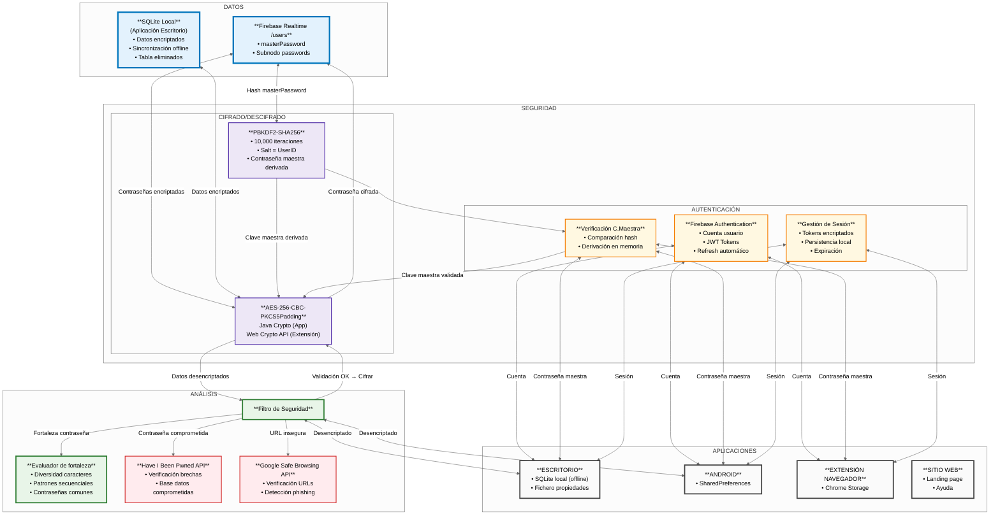

```mermaid
---
config:
  theme: neutral
---
graph TB
    subgraph DATOS["DATOS"]
        direction LR
        FIREBASE_USERS["**Firebase Realtime /users**<br/>• masterPassword<br/>• Subnodo passwords"]
        SQLITE_LOCAL["**SQLite Local**<br/>(Aplicación Escritorio)<br/>• Datos encriptados<br/>• Sincronización offline<br/>• Tabla eliminados"]
    end

    subgraph SEGURIDAD["SEGURIDAD"]
        direction TB
        
        subgraph AUTH_LAYER["AUTENTICACIÓN"]
            direction LR
            FIREBASE_AUTH["**Firebase Authentication**<br/>• Cuenta usuario<br/>• JWT Tokens<br/>• Refresh automático"]
            SESSION_MGMT["**Gestión de Sesión**<br/>• Tokens encriptados<br/>• Persistencia local<br/>• Expiración"]
            MASTER_VERIFY["**Verificación C.Maestra**<br/>• Comparación hash<br/>• Derivación en memoria"]
        end
        
        subgraph CRYPTO_LAYER["CIFRADO/DESCIFRADO"]
            direction LR
            AES["**AES-256-CBC-PKCS5Padding**<br/>Java Crypto (App)<br/>Web Crypto API (Extensión)"]
            PBKDF2_ALGO["**PBKDF2-SHA256**<br/>• 10,000 iteraciones<br/>• Salt = UserID<br/>• Contraseña maestra derivada"]
        end
    end

    subgraph ANALISIS["ANÁLISIS"]
        direction LR
        SECURITY_FILTER["**Filtro de Seguridad**"]
        EVALUATOR["**Evaluador de fortaleza**<br/>• Diversidad caracteres<br/>• Patrones secuenciales<br/>• Contraseñas comunes"]
        HIBP_API["**Have I Been Pwned API**<br/>• Verificación brechas<br/>• Base datos comprometidas"]
        GOOGLE_SAFE["**Google Safe Browsing API**<br/>• Verificación URLs<br/>• Detección phishing"]
    end

    subgraph APPS["APLICACIONES"]
        direction LR
        DESKTOP["**ESCRITORIO**<br/>• SQLite local (offline)<br/>• Fichero propiedades"]
        ANDROID["**ANDROID**<br/>• SharedPreferences"]
        WEBEXT["**EXTENSIÓN NAVEGADOR**<br/>• Chrome Storage"]
        WEBSITE["**SITIO WEB**<br/>• Landing page<br/>• Ayuda"]
    end

    %% === FLUJOS ENTRE COMPONENTES ===

    FIREBASE_USERS <-->|"Contraseñas encriptadas"| AES
    FIREBASE_USERS <-->|"Hash masterPassword"| PBKDF2_ALGO
    SQLITE_LOCAL <-->|"Datos encriptados"| AES
    
    %% Seguridad / Encriptación
    PBKDF2_ALGO --> MASTER_VERIFY
    PBKDF2_ALGO -->|"Clave maestra derivada"| AES
    MASTER_VERIFY -->|"Clave maestra validada"| AES

    %% Filtro de seguridad
    AES -->|"Datos desencriptados"| SECURITY_FILTER
    SECURITY_FILTER -->|"Validación OK → Cifrar"| AES
    AES -->|"Contraseña cifrada"| FIREBASE_USERS

    %% Análisis de Seguridad
    SECURITY_FILTER -->|"Fortaleza contraseña"| EVALUATOR
    SECURITY_FILTER -->|"Contraseña comprometida"| HIBP_API
    SECURITY_FILTER -->|"URL insegura"| GOOGLE_SAFE

    %% Aplicaciones
    FIREBASE_AUTH <-->|"Cuenta"| DESKTOP
    FIREBASE_AUTH <-->|"Cuenta"| ANDROID
    FIREBASE_AUTH <-->|"Cuenta"| WEBEXT

    MASTER_VERIFY <-->|"Contraseña maestra"| DESKTOP
    MASTER_VERIFY <-->|"Contraseña maestra"| ANDROID
    MASTER_VERIFY <-->|"Contraseña maestra"| WEBEXT

    SESSION_MGMT <-->|"Sesión"| DESKTOP
    SESSION_MGMT <-->|"Sesión"| ANDROID
    SESSION_MGMT <-->|"Sesión"| WEBEXT

    SECURITY_FILTER <-->|"Desencriptado"| DESKTOP
    SECURITY_FILTER <-->|"Desencriptado"| ANDROID

    %% === ESTILOS ===
    classDef dataStyle fill:#e3f2fd,stroke:#0277bd,stroke-width:4px
    classDef securityStyle fill:#f3e5f5,stroke:#7b1fa2,stroke-width:3px
    classDef authStyle fill:#fff8e1,stroke:#f57c00,stroke-width:2px
    classDef cryptoStyle fill:#ede7f6,stroke:#512da8,stroke-width:2px
    classDef analysisStyle fill:#e8f5e8,stroke:#2e7d32,stroke-width:3px
    classDef appStyle fill:#fafafa,stroke:#424242,stroke-width:3px
    classDef apiStyle fill:#ffebee,stroke:#d32f2f,stroke-width:2px

    class FIREBASE_USERS,SQLITE_LOCAL dataStyle
    class FIREBASE_AUTH,SESSION_MGMT,MASTER_VERIFY authStyle
    class AES,PBKDF2_ALGO cryptoStyle
    class SECURITY_FILTER,EVALUATOR analysisStyle
    class HIBP_API,GOOGLE_SAFE apiStyle
    class DESKTOP,ANDROID,WEBEXT,WEBSITE appStyle

```
