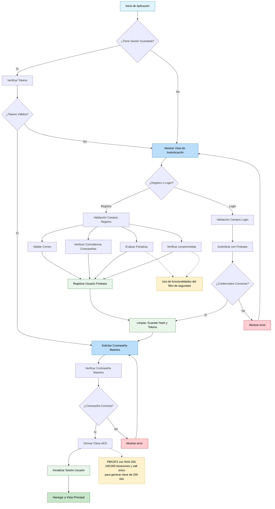

```mermaid
flowchart TD
    A["Inicio de Aplicación"] --> B{"¿Tiene Sesión Guardada?"}
    B -- Sí --> C["Verificar Tokens"]
    B -- No --> D["Mostrar Vista de Autenticación"]
    C --> E{"¿Tokens Válidos?"}
    E -- Sí --> F["Solicitar Contraseña Maestra"]
    E -- No --> D
    D --> G{"¿Registro o Login?"}
    G -- Registro --> J["Validación Campos Registro"]
    G -- Login --> I["Validación Campos Login"]

    J --> V1["Validar Correo"]
    J --> V2["Verificar Coincidencia Contraseñas"]
    J --> V3["Evaluar Fortaleza"]
    J --> V4["Verificar comprometida"]
    
    V1 --> M["Registrar Usuario Firebase"]
    V2 --> M
    V3 --> M
    V4 --> M

    I --> N["Autenticar con Firebase"]
    N --> O{"¿Credenciales Correctas?"}
    O -- Sí --> S["Limpiar, Guardar Hash y Tokens"]
    O -- No --> P["Mostrar error"]
    M --> S
    S --> F
    P --> D
    F --> T["Verificar Contraseña Maestra"]
    T --> U{"¿Contraseña Correcta?"}
    U -- Sí --> X["Derivar Clave AES"]
    U -- No --> BB["Mostrar error"]
    BB --> F
    X --> Y["Inicializar Sesión Usuario"]
    Y --> Z["Navegar a Vista Principal"]

    %% Notas de explicación
    V3 -.-> NOTE1["Uso de funcionalidades del filtro de seguridad"]
    V4 -.-> NOTE1
    X -.-> NOTE2["PBKDF2 con SHA-256,<br>100,000 iteraciones y salt único<br>para generar clave de 256 bits"]

    %% Estilo para notas
    NOTE1:::noteStyle
    NOTE2:::noteStyle

    %% Definición de clases de estilo
    classDef inicio fill:#E1F5FE,stroke:#0288D1,color:#000
    classDef auth fill:#BBDEFB,stroke:#1976D2,color:#000
    classDef success fill:#E8F5E9,stroke:#388E3C,color:#000
    classDef error fill:#FFCDD2,stroke:#D32F2F,color:#000
    classDef final fill:#C8E6C9,stroke:#2E7D32,color:#000
    classDef noteStyle fill:#FFF2CC,stroke:#D6B656,color:#000

    %% Asignación de clases a nodos
    class A inicio
    class D,F auth
    class M,S,Y success
    class P,BB error
    class Z final
```