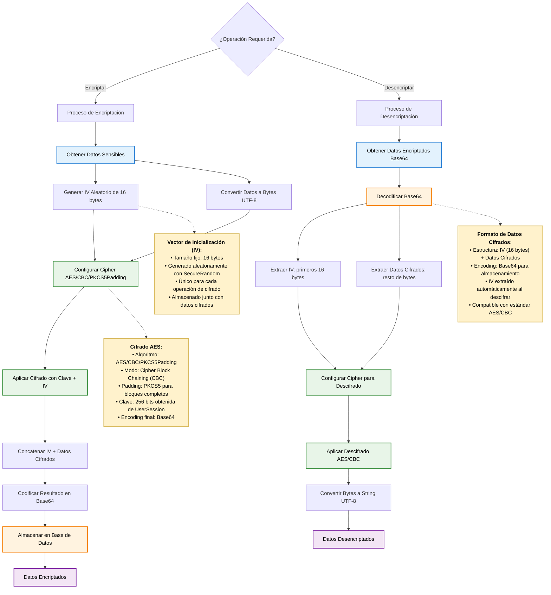

```mermaid
flowchart TD
    A{"¿Operación Requerida?"} -- Encriptar --> B["Proceso de Encriptación"]
    A -- Desencriptar --> C["Proceso de Desencriptación"]
    B --> D["Obtener Datos Sensibles"]
    D --> E["Generar IV Aleatorio de 16 bytes"] & F["Convertir Datos a Bytes UTF-8"]
    E --> G["Configurar Cipher AES/CBC/PKCS5Padding"]
    F --> G
    G --> H["Aplicar Cifrado con Clave + IV"]
    H --> I["Concatenar IV + Datos Cifrados"]
    I --> J["Codificar Resultado en Base64"]
    J --> K["Almacenar en Base de Datos"]
    C --> L["Obtener Datos Encriptados Base64"]
    L --> M["Decodificar Base64"]
    M --> N["Extraer IV: primeros 16 bytes"] & O["Extraer Datos Cifrados: resto de bytes"]
    N --> P["Configurar Cipher para Descifrado"]
    O --> P
    P --> Q["Aplicar Descifrado AES/CBC"]
    Q --> R["Convertir Bytes a String UTF-8"]
    K --> RESULT1["Datos Encriptados"]
    R --> RESULT2["Datos Desencriptados"]
    E -.-> NOTA1["<b>Vector de Inicialización (IV):</b><br>• Tamaño fijo: 16 bytes<br>• Generado aleatoriamente con SecureRandom<br>• Único para cada operación de cifrado<br>• Almacenado junto con datos cifrados<br>"]
    G -.-> NOTA2["<b>Cifrado AES:</b><br>• Algoritmo: AES/CBC/PKCS5Padding<br>• Modo: Cipher Block Chaining (CBC)<br>• Padding: PKCS5 para bloques completos<br>• Clave: 256 bits obtenida de UserSession<br>• Encoding final: Base64"]
    M -.-> NOTA3["<b>Formato de Datos Cifrados:</b><br>• Estructura: IV (16 bytes) + Datos Cifrados<br>• Encoding: Base64 para almacenamiento<br>• IV extraído automáticamente al descifrar<br>• Compatible con estándar AES/CBC"]

     D:::processStyle
     G:::cryptoStyle
     H:::cryptoStyle
     K:::storageStyle
     L:::processStyle
     M:::storageStyle
     P:::cryptoStyle
     Q:::cryptoStyle
     RESULT1:::resultStyle
     RESULT2:::resultStyle
     NOTA1:::noteStyle
     NOTA2:::noteStyle
     NOTA3:::noteStyle
    classDef processStyle fill:#E3F2FD,stroke:#1976D2,stroke-width:2px,color:#000
    classDef cryptoStyle fill:#E8F5E8,stroke:#388E3C,stroke-width:2px,color:#000
    classDef storageStyle fill:#FFF3E0,stroke:#F57C00,stroke-width:2px,color:#000
    classDef resultStyle fill:#F3E5F5,stroke:#7B1FA2,stroke-width:2px,color:#000
    classDef noteStyle fill:#fff2cc,stroke:#d6b656,stroke-width:2px,color:#000
```