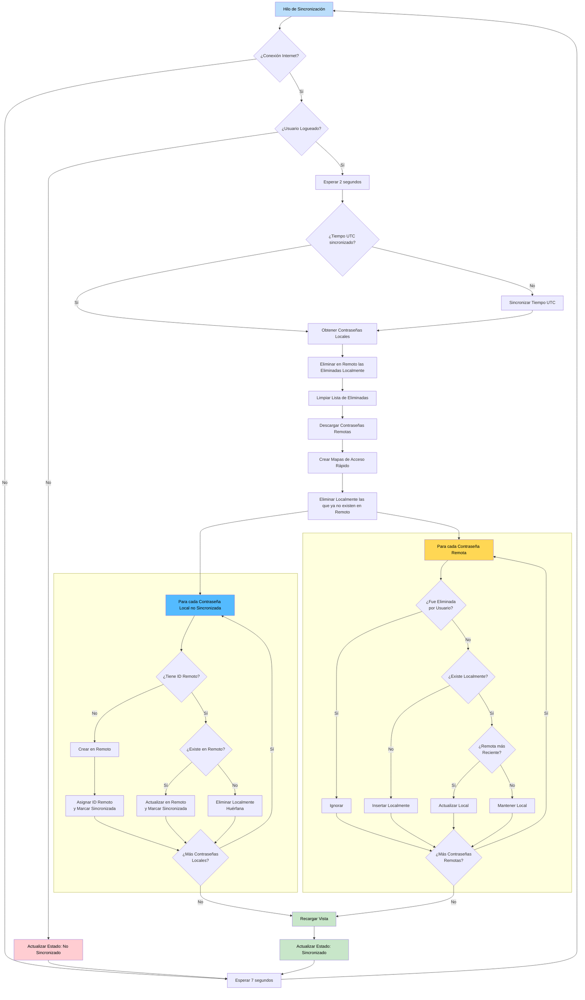

```mermaid
flowchart TD
    A["Hilo de Sincronización"] --> B{"¿Conexión Internet?"}
    B -- No --> C["Esperar 7 segundos"]
    B -- Sí --> D{"¿Usuario Logueado?"}
    C --> A
    D -- No --> E["Actualizar Estado: No Sincronizado"]
    D -- Sí --> F["Esperar 2 segundos"]
    E --> C
    F --> G{"¿Tiempo UTC sincronizado?"}
    G -- No --> H["Sincronizar Tiempo UTC"]
    G -- Sí --> I["Obtener Contraseñas Locales"]
    H --> I
    I --> J["Eliminar en Remoto las Eliminadas Localmente"]
    J --> K["Limpiar Lista de Eliminadas"]
    K --> L["Descargar Contraseñas Remotas"]
    L --> M["Crear Mapas de Acceso Rápido"]    
    M --> N["Eliminar Localmente las que ya no existen en Remoto"]
    
    %% Rama izquierda: Local → Remoto
    N --> P1["Para cada Contraseña Local no Sincronizada"]
    P1 --> P2{"¿Tiene ID Remoto?"}
    P2 -- No --> P3["Crear en Remoto"]
    P2 -- Sí --> P4{"¿Existe en Remoto?"}
    P3 --> P5["Asignar ID Remoto<br/>y Marcar Sincronizada"]
    P4 -- Sí --> P6["Actualizar en Remoto<br/>y Marcar Sincronizada"]
    P4 -- No --> P7["Eliminar Localmente<br/>Huérfana"]    
    P5 --> P8{"¿Más Contraseñas<br/>Locales?"}
    P6 --> P8    
    P7 --> P8
    P8 -- Sí --> P1
    P8 -- No --> FF["Recargar Vista"]
    
    %% Rama derecha: Remoto → Local (paralela)
    N --> R1["Para cada Contraseña Remota"]
    R1 --> R2{"¿Fue Eliminada<br/>por Usuario?"}
    R2 -- Sí --> R3["Ignorar"]
    R2 -- No --> R4{"¿Existe Localmente?"}
    R4 -- No --> R5["Insertar Localmente"]
    R4 -- Sí --> R6{"¿Remota más<br/>Reciente?"}
    R6 -- Sí --> R7["Actualizar Local"]
    R6 -- No --> R8["Mantener Local"]    
    R3 --> R9{"¿Más Contraseñas<br/>Remotas?"}
    R5 --> R9
    R7 --> R9    
    R8 --> R9
    R9 -- Sí --> R1
    R9 -- No --> FF
    
    %% Convergencia de ambas ramas
    FF --> GG["Actualizar Estado: Sincronizado"]
    GG --> C    
    
    %% Estilos
    style A fill:#BBDEFB, color: #000000
    style E fill:#FFCDD2, color: #000000
    style FF fill:#C8E6C9, color: #000000
    style GG fill:#C8E6C9, color: #000000
    style P1 fill:#54bbff, color: #000000
    style R1 fill:#ffd754, color: #000000
    
    %% Posicionamiento para visualización paralela
    subgraph " "
        P1
        P2
        P3
        P4
        P5
        P6
        P7
        P8
    end
    
    subgraph "  "
        R1
        R2
        R3
        R4
        R5
        R6
        R7
        R8
        R9
    end
```
