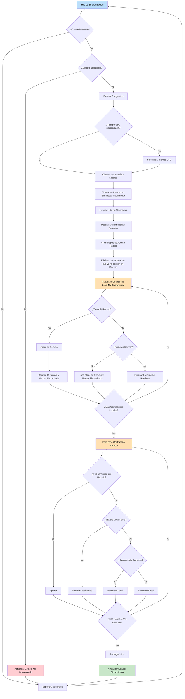

```mermaid
flowchart TD
    A["Hilo de Sincronización"] --> B{"¿Conexión Internet?"}
    B -- No --> C["Esperar 7 segundos"]
    B -- Sí --> D{"¿Usuario Logueado?"}
    C --> A
    D -- No --> E["Actualizar Estado: No Sincronizado"]
    D -- Sí --> F["Esperar 2 segundos"]
    E --> C
    F --> G{"¿Tiempo UTC sincronizado?"}
    G -- No --> H["Sincronizar Tiempo UTC"]
    G -- Sí --> I["Obtener Contraseñas Locales"]
    H --> I
    I --> J["Eliminar en Remoto las Eliminadas Localmente"]
    J --> K["Limpiar Lista de Eliminadas"]
    K --> L["Descargar Contraseñas Remotas"]
    L --> M["Crear Mapas de Acceso Rápido"]
    M --> N["Eliminar Localmente las que ya no existen en Remoto"]
    N --> O["Para cada Contraseña Local No Sincronizada"]
    O --> P{"¿Tiene ID Remoto?"}
    P -- No --> Q["Crear en Remoto"]
    P -- Sí --> R{"¿Existe en Remoto?"}
    Q --> S["Asignar ID Remoto y Marcar Sincronizada"]
    R -- Sí --> T["Actualizar en Remoto y Marcar Sincronizada"]
    R -- No --> U["Eliminar Localmente Huérfana"]
    S --> V{"¿Más Contraseñas Locales?"}
    T --> V
    U --> V
    V -- Sí --> O
    V -- No --> W["Para cada Contraseña Remota"]
    W --> X{"¿Fue Eliminada por Usuario?"}
    X -- Sí --> Y["Ignorar"]
    X -- No --> Z{"¿Existe Localmente?"}
    Z -- No --> AA["Insertar Localmente"]
    Z -- Sí --> BB{"¿Remota más Reciente?"}
    BB -- Sí --> CC["Actualizar Local"]
    BB -- No --> DD["Mantener Local"]
    Y --> EE{"¿Más Contraseñas Remotas?"}
    AA --> EE
    CC --> EE
    DD --> EE
    EE -- Sí --> W
    EE -- No --> FF["Recargar Vista"]
    FF --> GG["Actualizar Estado: Sincronizado"]
    GG --> C

    style A fill:#BBDEFB, color: #000000
    style E fill:#FFCDD2, color: #000000
    style O fill:#FFE0B2, color: #000000
    style W fill:#FFE0B2, color: #000000
    style GG fill:#C8E6C9, color: #000000
```
