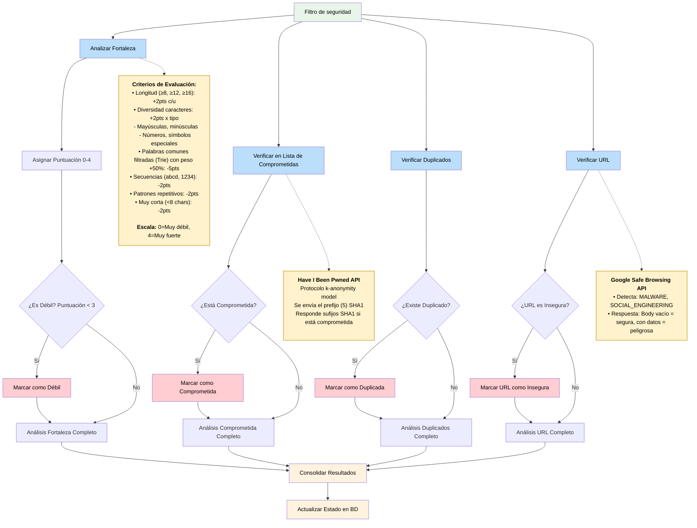

```mermaid
flowchart TD
    A["Filtro de seguridad"] --> B["Analizar Fortaleza"] & C["Verificar en Lista de Comprometidas"] & D["Verificar Duplicados"] & E["Verificar URL"]
    B --> F["Asignar Puntuación 0-4"]
    F --> G{"¿Es Débil? Puntuación &lt; 3"}
    G -- Sí --> H["Marcar como Débil"]
    G -- No --> M["Análisis Fortaleza Completo"]
    H --> M
    C --> I{"¿Está Comprometida?"}
    I -- Sí --> J["Marcar como Comprometida"]
    I -- No --> N["Análisis Comprometida Completo"]
    J --> N
    D --> K{"¿Existe Duplicado?"}
    K -- Sí --> L["Marcar como Duplicada"]
    K -- No --> O["Análisis Duplicados Completo"]
    L --> O
    E --> P{"¿URL es Insegura?"}
    P -- Sí --> Q["Marcar URL como Insegura"]
    P -- No --> R["Análisis URL Completo"]
    Q --> R
    M --> S["Consolidar Resultados"]
    N --> S
    O --> S
    R --> S
    S --> T["Actualizar Estado en BD"]
    B -.-> NOTA1["<b>Criterios de Evaluación:</b><br>• Longitud (≥8, ≥12, ≥16): +2pts c/u<br>• Diversidad caracteres: +2pts x tipo<br>  - Mayúsculas, minúsculas<br>  - Números, símbolos especiales<br>• Palabras comunes filtradas (Trie) con peso +50%: -5pts<br>• Secuencias (abcd, 1234): -2pts<br>• Patrones repetitivos: -2pts<br>• Muy corta (&lt;8 chars): -2pts<br><br><b>Escala:</b> 0=Muy débil, 4=Muy fuerte"]
    C -.-> NOTA2["<b>Have I Been Pwned API</b><br>Protocolo k-anonymity model<br>Se envía el prefijo (5) SHA1<br>Responde sufijos SHA1 si está comprometida<br><br>"]
    E -.-> NOTA3["<b>Google Safe Browsing API</b><br>• Detecta: MALWARE, SOCIAL_ENGINEERING<br>• Respuesta: Body vacío = segura, con datos = peligrosa"]

     A:::startStyle
     B:::analyzeStyle
     C:::analyzeStyle
     D:::analyzeStyle
     E:::analyzeStyle
     H:::weakStyle
     J:::weakStyle
     L:::weakStyle
     Q:::weakStyle
     S:::consolidateStyle
     T:::consolidateStyle
     NOTA1:::noteStyle
     NOTA2:::noteStyle
     NOTA3:::noteStyle
    classDef noteStyle fill:#fff2cc,stroke:#d6b656,stroke-width:2px,color:#000
    classDef weakStyle fill:#FFCDD2,color:#000
    classDef analyzeStyle fill:#BBDEFB,color:#000
    classDef startStyle fill:#E8F5E8,color:#000
    classDef consolidateStyle fill:#FFF3E0,color:#000
```